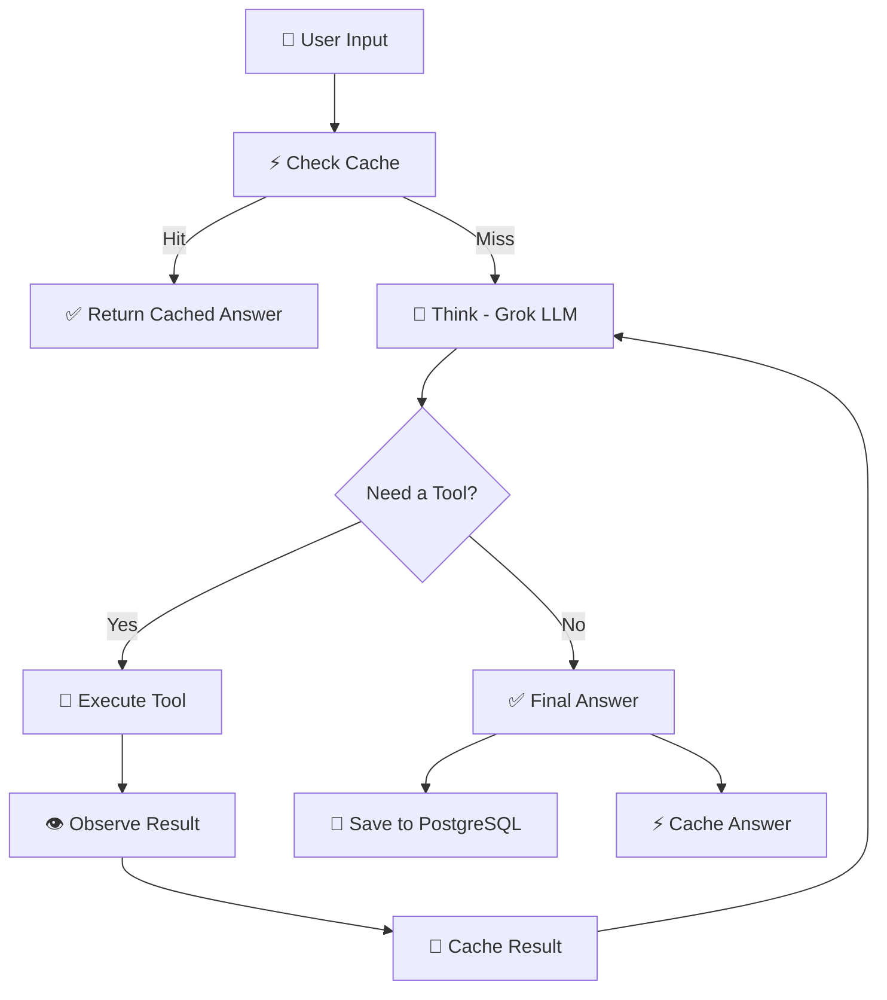

# ⚡ AI Agent

An autonomous AI agent that thinks step-by-step, selects tools dynamically, executes them, observes outputs, and delivers intelligent answers — powered by **Grok** via OpenRouter.


---

## 🚀 Architecture



---

## 🛠️ Tools (9)

| Tool | Description |
|------|-------------|
| 🌐 `web_search` | Search the web via DuckDuckGo |
| 🧮 `calculator` | Safe math with sympy |
| 🌤️ `weather` | Current weather for any city |
| 📖 `wikipedia` | Wikipedia article summaries |
| 🔗 `read_url` | Fetch & read any web page |
| 🕐 `datetime` | Time zones & date calculations |
| 📄 `read_file` | Read TXT and PDF files |
| 🐍 `python_executor` | Execute Python code (sandboxed) |
| 📚 `doc_search` | RAG semantic search over documents |

---

## 🗄️ Database Stack

| Database | Purpose | Fallback |
|----------|---------|----------|
| **PostgreSQL** (Supabase) | Persistent conversations | SQLite (local) |
| **ChromaDB** | RAG document search | Direct text injection |
| **Redis** | Cache LLM + tool responses | In-memory dict |

All databases have **graceful fallbacks** — the app works without any external services configured.

---

## 📦 Project Structure

```
My-AI-ReAct-Framework/
├── app.py                    # ⚡ Streamlit frontend
├── server.py                 # 🔌 FastAPI backend (optional)
├── supabase_setup.sql        # 🗄️ PostgreSQL schema
├── agent/
│   ├── react_agent.py        # 🧠 Core reasoning loop
│   ├── llm.py                # 🤖 OpenRouter API client
│   ├── parser.py             # 📝 Parse LLM output
│   ├── memory.py             # 💾 Supabase + SQLite memory
│   ├── cache.py              # ⚡ Redis caching layer
│   └── rag.py                # 📚 ChromaDB RAG pipeline
├── tools/
│   ├── base.py               # 🔧 Tool registry
│   ├── search_tool.py        # 🌐 Web search
│   ├── calculator_tool.py    # 🧮 Calculator
│   ├── weather_tool.py       # 🌤️ Weather
│   ├── wikipedia_tool.py     # 📖 Wikipedia
│   ├── url_reader_tool.py    # 🔗 URL reader
│   ├── datetime_tool.py      # 🕐 Date/time
│   ├── file_tool.py          # 📄 File reader
│   ├── python_tool.py        # 🐍 Python executor
│   └── rag_search_tool.py    # 📚 Document search (RAG)
├── prompts/
│   └── react_prompt.txt      # 📋 System prompt
├── .env.example
└── requirements.txt
```

---

## ⚡ Quick Start

```bash
# 1. Clone
git clone https://github.com/yourusername/My-AI-ReAct-Framework.git && cd My-AI-ReAct-Framework

# 2. Virtual environment
python3 -m venv venv && source venv/bin/activate

# 3. Install
pip install -r requirements.txt

# 4. Configure (get free key at https://openrouter.ai/keys)
cp .env.example .env
# Edit .env → add your OPENROUTER_API_KEY

# 5. Run
streamlit run app.py
```

### Optional: Cloud Databases

**Supabase (persistent memory):**
1. Go to [supabase.com](https://supabase.com) → Create project
2. Run `supabase_setup.sql` in SQL Editor
3. Add `SUPABASE_URL` and `SUPABASE_KEY` to `.env`

**Redis (caching):**
1. Go to [redis.io/try-free](https://redis.io/try-free) → Create database
2. Add `REDIS_URL` to `.env`

---

## 📄 License

MIT License — free to use, modify, and share.
