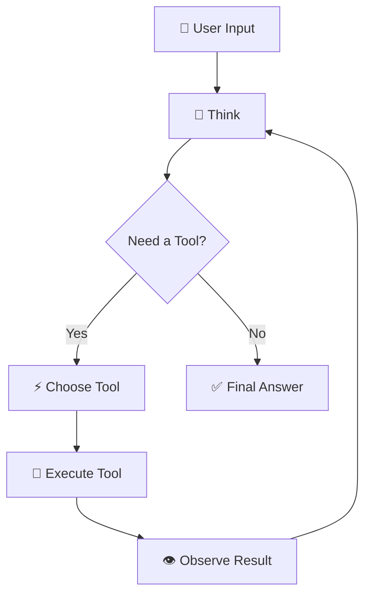

# ⚡ AI Agent

An autonomous AI agent that thinks step-by-step, selects tools dynamically, executes them, observes outputs, and delivers intelligent answers — powered by **Grok** via OpenRouter.


---

## 🚀 How It Works

```
User Question → Thought → Action → Observation → ... → Final Answer
```



---

## 🛠️ Available Tools (8)

| Tool | Description |
|------|-------------|
| 🌐 `web_search` | Search the web via DuckDuckGo |
| 🧮 `calculator` | Safe math with sympy |
| 🌤️ `weather` | Current weather for any city |
| 📖 `wikipedia` | Wikipedia article summaries |
| 🔗 `read_url` | Fetch & read any web page |
| 🕐 `datetime` | Time zones & date calculations |
| 📄 `read_file` | Read TXT and PDF files |
| 🐍 `python_executor` | Execute Python code (sandboxed) |

---

## 📦 Project Structure

```
My-AI/
├── app.py                    # ⚡ Streamlit frontend
├── server.py                 # 🔌 FastAPI backend (optional)
├── agent/
│   ├── react_agent.py        # 🧠 Core reasoning loop
│   ├── llm.py                # 🤖 OpenRouter API client
│   ├── parser.py             # 📝 Parse LLM output
│   └── memory.py             # 💾 SQLite conversation memory
├── tools/
│   ├── base.py               # 🔧 Tool registry
│   ├── search_tool.py        # 🌐 Web search
│   ├── calculator_tool.py    # 🧮 Calculator
│   ├── weather_tool.py       # 🌤️ Weather
│   ├── wikipedia_tool.py     # 📖 Wikipedia
│   ├── url_reader_tool.py    # 🔗 URL reader
│   ├── datetime_tool.py      # 🕐 Date/time
│   ├── file_tool.py          # 📄 File reader
│   └── python_tool.py        # 🐍 Python executor
├── prompts/
│   └── react_prompt.txt      # 📋 System prompt
├── .env.example
└── requirements.txt
```

---

## ⚡ Quick Start

```bash
# 1. Clone
git clone https://github.com/yourusername/My-AI.git && cd My-AI

# 2. Virtual environment
python3 -m venv venv && source venv/bin/activate

# 3. Install
pip install -r requirements.txt

# 4. Configure (get free key at https://openrouter.ai/keys)
cp .env.example .env
# Edit .env → add your OPENROUTER_API_KEY

# 5. Run
streamlit run app.py
```

---

## 💡 Example Prompts

| Prompt | Tools Used |
|--------|-----------|
| "What's the weather in Paris?" | 🌤️ Weather |
| "Search for latest AI news" | 🌐 Web Search |
| "Tell me about quantum computing" | 📖 Wikipedia |
| "What is sqrt(2025) + 3^5?" | 🧮 Calculator |
| "What time is it in Tokyo?" | 🕐 DateTime |
| "Read this URL: https://example.com" | 🔗 URL Reader |
| "Write Python code for Fibonacci" | 🐍 Python |

---

## 📄 License

MIT License — free to use, modify, and share.
